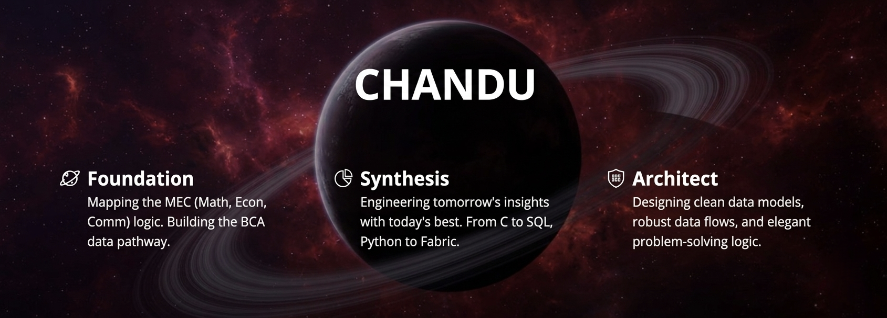

# ⚡ Chigurupati Chandu
### Data Analyst | Future BCA | Fabric Architect

---

---
## 📂 About Me
A dedicated student leveraging strong mathematical and economic logic from an MEC background to engineer robust data solutions. Actively building expertise in rare and high-value technical stacks like **Microsoft Fabric** to provide unique market value.

I believe in the 'Proof of Work' strategy—solving logic on paper before writing code. 🖋️

---
## 📂 Profile Status
- **Roadmap:** MEC (Math, Econ, Comm) ➡️ BCA (Bachelor of Computer Applications) ➡️ Data Architect.
- **Focus:** Mastering C programming foundations for logical depth, plus SQL and Excel for analytics.
- **Rare Specialization:** Microsoft Fabric ecosystem (OneLake, Data Factory, Synapse, Power BI/Dataflow Gen2).
- **Aesthetic:** Minimalist, direct, and efficient.
---

## Technical Skills

**Rare Specializations**

**Foundations**

---

## Featured Repository
📂 **[C-Foundations](https://github.com/Chandu-C-Analyst/C-Foundations)**
> Documenting the transition from logical problem-solving to machine-executable code.

---

## Contact
**Email:** [chandu.c.analyst@gmail.com](mailto:chandu.c.analyst@gmail.com)

